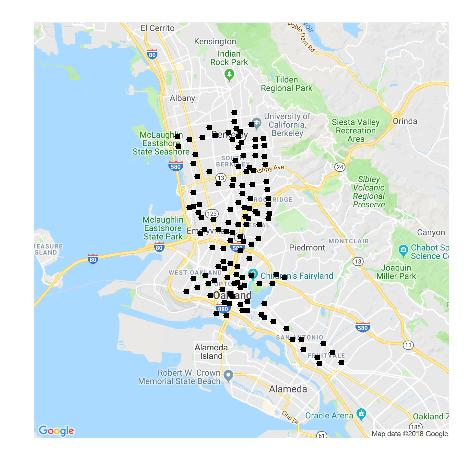
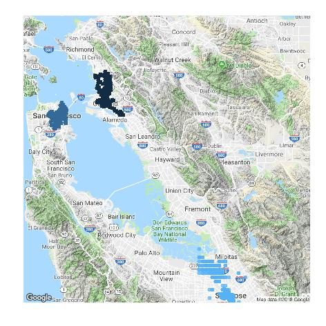

```{r setup, include=FALSE}
knitr::opts_chunk$set(echo = FALSE)
```

## About me

[Prof. Eric A. Suess, CSU East Bay](http://www.sci.csueastbay.edu/~esuess/)

I am a long time R user.  Started using S in 1988.  Used S+ in graduate school 1990's.  Wrote a book with my co-author, published 2010.  [Probability Simulations and Gibbs Sampling.](https://www.springer.com/us/book/9780387402734)  [webpage](http://www.sci.csueastbay.edu/~esuess/psgs/)

Continuing to evolve as an R user with RStudio.

Love using R.  I teach R as a Professor.  I encourage the use of R.  I encourage others to encourage others to use R.  

- Joe Rickert, RStudio, BARUG
- Gabriella, IBM, R-Ladies
- Navdeep, h2O, autoML

## About me

I use R in my professional work.  Currently at machineVantage as Chief Statistician.

I use R to do data munging, data analysis, text mining, time series forecasting.

## About me

I like to test out R based software.  

I am currently a [R++](https://rplusplus.com/en/) [beta-tester](https://rplusplus.com/en/beta-form)

Recently discovered [Exploratory](https://exploratory.io/)

## Ford GoBikes Oakland

I am going to walk you through my initial analysis of the 2018 Ford GoBike data.

**Goal 0:** Use R and RStudio to produce a reproducible analysis and the tidyverse.

**Goal 1:** Replicate the station map in Oakland.

**Goal 2:** See if there is a difference in bike usage by women and men?

**Goal 3:** Try to see how the bikes are used.  How far are the bike ridden?  How long are they ridden?  

**Goal 4:** Try to implement the same analysis pulling data from the GBFS API using the gbfs R package.

## Ford GoBikes Oakland

Driving around Oakland in the past few years you have probably seen the [Ford GoBikes](https://www.fordgobike.com/).

I went to the website and wanted to replicate the [station map](https://member.fordgobike.com/map/) in a static visualization.

This lead me to the [System Data](https://www.fordgobike.com/system-data).  

And their [Download](https://s3.amazonaws.com/fordgobike-data/index.html) for downloading .csv files.

## General Bikeshare Feed Specification (GBFS)

Then I was lead to the General Bikeshare Feed Specification [gbfs github](https://github.com/NABSA/gbfs/blob/master/gbfs.md).

Finally, to the R package [gbfs](https://github.com/ds-civic-data/gbfs).

## First I tested out the .csv files

Lots of the same files with the same file name structure.

     fordgobike201801 <- read_csv(file="./data/201801-fordgobike-tripdata.csv")
     fordgobike201802 <- read_csv(file="./data/201802-fordgobike-tripdata.csv")

How to download them with a loop?

## Ford GoBike stations

Here is the link to the [Ford GoBike stations](https://member.fordgobike.com/map/)


## Oakland

My map of Oakland stations.



## Bay Area stations

My map of Bay Area stations.



## Wrangling

To make this visualization

- had to change the type of one variable from *char* to *int* for two of the June and July, due to missing values
- had to remove errors in the geolocation data
- noticed some 120+ year old people, so removed them

## Discoverd the R package gbfs

Once I discovered the R package that connects directly to the API.  I started to redo the analysis.


